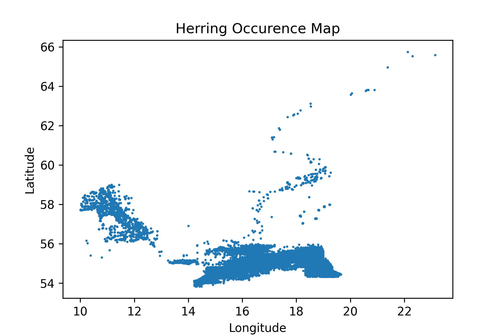
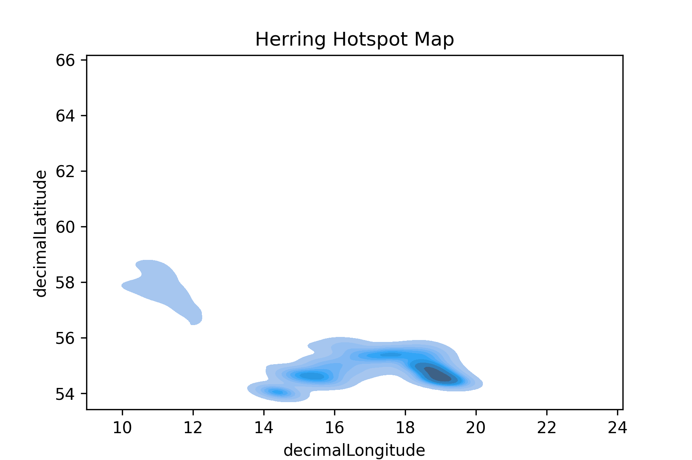
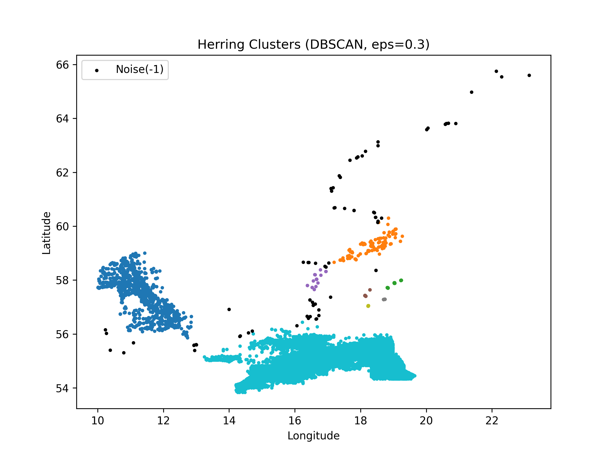

# Herring-spatial-analysis
## I Background
- Baltic herring (*Clupea harengus*) is a key species in the Baltic Sea ecosystem, linking lower and higher trophic levels.
- Understanding its spatial distribution and seasonal patterns is essential for biodiversity conservation and fisheries management. 
- This project applies data science and machine learning methods to explore herring occurrence patterns using open biodiversity data.
## II Data Source
- Data from **GBIF (Global Biodiversity Information Facility)** Access via https://www.gbif.org
- Species: *Clupea harengus*
- Countries included: Sweden,Denmark, Poland
- Data type: occurence records with coordinates and timestamps
## III Methods
### 1.Data processing
- Selected key variables:
  - latitude, longitude
  - data
  - country
- Removed missing values
- Coverted date to datetime format
- Extracted month and year
### 2.Spatial filtering
- Focused on Baltic Sea region:
  - Latitude: 53-66
  - Longitude: 10-30
### 3.Visualization
-Scatter plot (occurrence map)
- Kernel Density Estimation (KDE) for hotspot detection
- Monthly histogram for temporal distribution
### 4.Clustering (Machine Learning)
- Applied **DBSCAN**
- Parameter tuning using k-distance graph
- Compared different 'eps' values (0.2, 0.25, 0.3)
## IV Results
### Occurence Map

### Hotspot Map

### Clustering (eps = 0.3)

